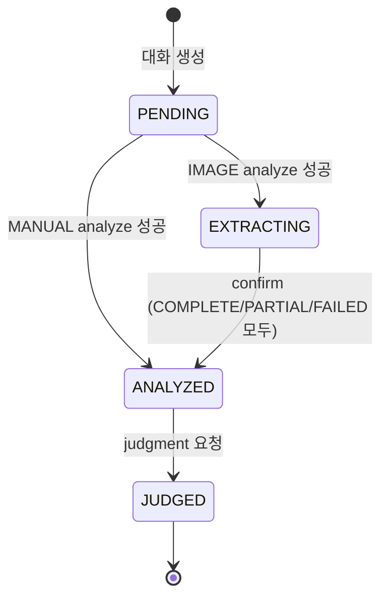

# AI Manager 이미지/수기 입력 모드 분리 PRD

> **버전:** 2.1 (확정판)  
> **작성일:** 2025-12-10  
> **목적:** 프론트엔드에서 "영수증 입력하기" / "수기로 입력하기" 선택 기반 API 개선

---

## 1. 개요

### 1.1 현재 문제
- `SpendingAnalyzeRequest` 필드에 `@NotBlank` 검증이 있어 이미지만 전송 불가
- 이미지 추출 실패 시 대응 전략 부재

### 1.2 목표
| 입력 모드 | 설명 | 필수 입력 |
|-----------|------|----------|
| **IMAGE** | 영수증 사진 업로드 → AI가 정보 추출 | 이미지 파일 |
| **MANUAL** | 수기로 직접 입력 | amount, storeName, category, paymentDate |

### 1.3 확정된 필드명 규칙

> [!IMPORTANT]
> 모든 Request/Response/Storage에서 **`paymentDate`** 통일 사용

| 위치 | 필드명 |
|------|--------|
| SpendingAnalyzeRequest | `paymentDate` |
| ConfirmExtractedDataRequest | `paymentDate` |
| extractedData (응답) | `paymentDate` |
| receiptInfo (응답) | `paymentDate` |
| missingFields (응답) | `"paymentDate"` |
| ai_conversation 테이블 | `payment_date` |

---

## 2. 사용자 플로우

### 2.1 수기 입력 모드 (MANUAL)
```
[프론트] 수기로 입력하기 선택
    ↓
[프론트] 금액, 가게명, 카테고리, 결제일 입력 폼 표시
    ↓
[API] POST /api/ai-manager/analyze (inputMode=MANUAL)
    ↓
[레제] 입력 정보 기반 심문 + 변명 선택지
    ↓
[API] POST /api/ai-manager/judgment
```

### 2.2 이미지 입력 모드 (IMAGE)
```
[프론트] 영수증 입력하기 선택
    ↓
[프론트] 카메라/갤러리에서 영수증 이미지 선택
    ↓
[API] POST /api/ai-manager/analyze (inputMode=IMAGE + 이미지)
    ↓
[AI] 이미지에서 정보 추출 시도
    ↓
┌─────────────────────────────────────────────────────┐
│ 응답: extractionStatus + 추출된 값 + 레제 첫 반응  │
└─────────────────────────────────────────────────────┘
    ↓
[프론트] 추출 결과 표시 (폼에 미리 채움, 수정 가능)
    ↓
[사용자] 확인/수정 후 "확인" 버튼
    ↓
[API] POST /api/ai-manager/confirm (수정된 값 전송)
    ↓
[레제] 최종 심문 + 변명 선택지
    ↓
[API] POST /api/ai-manager/judgment
```

---

## 3. 이미지 추출 폴백 전략

### 3.1 추출 상태
| extractionStatus | 설명 | 프론트 처리 |
|------------------|------|-------------|
| `COMPLETE` | 모든 필드 추출 성공 | 확인 후 바로 진행 가능 |
| `PARTIAL` | 일부 필드만 추출 | 누락 필드 필수 입력 요청 |
| `FAILED` | 추출 완전 실패 | 전체 수기 입력으로 안내 |

### 3.2 핵심 원칙
- 추출된 값도 **사용자가 수정 가능** (AI 오류 대응)
- **FAILED여도 `/confirm`으로 수기 완료 허용** (같은 conversationId 유지)
- 수정 전 원본 추출값은 별도 보관하지 않음 (덮어쓰기)

---

## 4. 검증 정책

### 4.1 MANUAL 모드 검증 (서비스 레이어)
```java
if (request.inputMode() == InputMode.MANUAL) {
    if (request.amount() == null || request.amount() < 1)
        throw new IllegalArgumentException("금액을 입력해주세요");
    if (request.storeName() == null || request.storeName().isBlank())
        throw new IllegalArgumentException("가게명을 입력해주세요");
    if (request.category() == null || request.category().isBlank())
        throw new IllegalArgumentException("카테고리를 선택해주세요");
    if (request.paymentDate() == null)
        throw new IllegalArgumentException("결제일을 입력해주세요");
    
    // category enum 매핑 검증
    try {
        SpendingCategory.valueOf(request.category());
    } catch (IllegalArgumentException e) {
        throw new IllegalArgumentException("유효하지 않은 카테고리입니다");
    }
}
```

### 4.2 IMAGE 모드 검증 (서비스 레이어)
```java
if (request.inputMode() == InputMode.IMAGE) {
    if (imageFile == null || imageFile.isEmpty())
        throw new IllegalArgumentException("영수증 이미지를 첨부해주세요");
    
    // 지출 정보 필드는 무시 (프론트에서 전송 안 함)
}
```

### 4.3 이미지 파일 검증 (에러 코드)
| 상황 | HTTP | 메시지 |
|------|------|--------|
| 이미지 파트 누락 | 400 | "영수증 이미지를 첨부해주세요" |
| 지원하지 않는 MIME | 400 | "지원하지 않는 이미지 형식입니다 (jpg, png, webp)" |
| JSON part 파싱 실패 | 400 | "요청 형식이 올바르지 않습니다" |
| **AI 인식 실패** | **200** | extractionStatus=FAILED |

---

## 5. `/confirm` 엔드포인트 제약

### 5.1 사용 조건
| 조건 | HTTP | 에러 코드 |
|------|------|----------|
| conversationId가 본인 것이 아님 | 404 | `AI_CONVERSATION_NOT_FOUND` |
| 상태가 `EXTRACTING`이 아님 | 400 | `AI_CONVERSATION_INVALID_STATUS` |
| 이미 `ANALYZED` 또는 `JUDGED` | 400 | `AI_CONVERSATION_INVALID_STATUS` |

### 5.2 FAILED/PARTIAL 후 플로우
- FAILED여도 `/confirm`으로 수기 입력 완료 **허용**
- 같은 `conversationId` 유지
- 새 MANUAL analyze 호출 불필요

---

## 6. 상태 전이 다이어그램



---

## 7. API 명세

### 7.1 POST /api/ai-manager/analyze

#### 케이스 1: 수기 입력 (MANUAL)
**요청:**
```json
{
  "inputMode": "MANUAL",
  "amount": 31000,
  "storeName": "치킨플러스",
  "category": "FOOD",
  "paymentDate": "2025-12-10",
  "memo": "야식"
}
```

**응답:**
```json
{
  "code": 200,
  "message": "레제가 지출을 분석했습니다.",
  "data": {
    "conversationId": 501,
    "status": "ANALYZED",
    "extractionStatus": null,
    "extractedData": null,
    "missingFields": null,
    "receiptInfo": {
      "amount": 31000,
      "storeName": "치킨플러스",
      "categoryLabel": "식비",
      "paymentDate": "2025-12-10"
    },
    "persona": {
      "mood": "STRICT",
      "moodLabel": "매우 엄격함",
      "script": "야, 3만원 넘게? 치킨플러스에서? 진심이야?"
    },
    "suggestedExcuses": [
      {"id": "STRESS", "text": "스트레스 비용", "type": "DEFENSE"},
      {"id": "NEED", "text": "단백질 보충", "type": "DEFENSE"},
      {"id": "ADMIT", "text": "인정합니다", "type": "GIVE_UP"}
    ]
  }
}
```

---

#### 케이스 2: 영수증 입력 (IMAGE) - COMPLETE
**요청:** `multipart/form-data`
- request: `{"inputMode": "IMAGE"}`
- image: 영수증.jpg

**응답:**
```json
{
  "code": 200,
  "message": "영수증에서 정보를 추출했습니다. 확인 후 진행해주세요.",
  "data": {
    "conversationId": 502,
    "status": "EXTRACTING",
    "extractionStatus": "COMPLETE",
    "extractedData": {
      "amount": 31000,
      "storeName": "치킨플러스 강남점",
      "category": "FOOD",
      "paymentDate": "2025-12-10"
    },
    "missingFields": null,
    "receiptInfo": null,
    "persona": {
      "mood": "CURIOUS",
      "moodLabel": "호기심",
      "script": "오, 영수증 찍어왔네? 어디 한번 볼까..."
    },
    "suggestedExcuses": null
  }
}
```

#### 케이스 3: 영수증 입력 (IMAGE) - PARTIAL
```json
{
  "data": {
    "status": "EXTRACTING",
    "extractionStatus": "PARTIAL",
    "extractedData": {
      "amount": 31000,
      "storeName": null,
      "category": "FOOD",
      "paymentDate": null
    },
    "missingFields": ["storeName", "paymentDate"],
    "persona": {
      "mood": "CONFUSED",
      "script": "음... 글씨가 잘 안 보이네. 가게 이름이랑 날짜 좀 알려줘."
    }
  }
}
```

#### 케이스 4: 영수증 입력 (IMAGE) - FAILED
```json
{
  "data": {
    "status": "EXTRACTING",
    "extractionStatus": "FAILED",
    "extractedData": null,
    "missingFields": ["amount", "storeName", "category", "paymentDate"],
    "persona": {
      "mood": "ANNOYED",
      "script": "이게 영수증이야? 아무것도 안 보이는데. 직접 쓰던가."
    }
  }
}
```

---

### 7.2 POST /api/ai-manager/confirm

**요청:**
```json
{
  "conversationId": 502,
  "amount": 31000,
  "storeName": "치킨플러스 강남점",
  "category": "FOOD",
  "paymentDate": "2025-12-10",
  "memo": ""
}
```

**응답:** MANUAL analyze 응답과 동일 구조 (status=ANALYZED)

**에러 응답:**
```json
// 상태가 EXTRACTING이 아닌 경우
{
  "code": 400,
  "status": "BAD_REQUEST",
  "message": "해당 대화는 확인 단계가 아닙니다."
}
```

---

## 8. DTO 변경

### 8.1 [NEW] InputMode.java
```java
public enum InputMode {
    IMAGE,   // 영수증 입력
    MANUAL   // 수기 입력
}
```

### 8.2 [NEW] ExtractionStatus.java
```java
public enum ExtractionStatus {
    COMPLETE,  // 전체 추출 성공
    PARTIAL,   // 부분 추출
    FAILED     // 추출 실패
}
```

### 8.3 [MODIFY] ConversationStatus.java
```java
public enum ConversationStatus {
    PENDING,
    EXTRACTING,  // 신규: 이미지 추출 완료, confirm 대기
    ANALYZED,
    JUDGED
}
```

### 8.4 [MODIFY] SpendingAnalyzeRequest.java
```java
public record SpendingAnalyzeRequest(
    @NotNull InputMode inputMode,
    Long amount,
    String storeName,
    String category,
    LocalDate paymentDate,
    String memo
) {}
```

### 8.5 [NEW] ConfirmExtractedDataRequest.java
```java
public record ConfirmExtractedDataRequest(
    @NotNull Long conversationId,
    @NotNull @Min(1) Long amount,
    @NotBlank String storeName,
    @NotBlank String category,
    @NotNull LocalDate paymentDate,
    String memo
) {}
```

### 8.6 [MODIFY] SpendingAnalyzeResponse.java
```java
public record SpendingAnalyzeResponse(
    Long conversationId,
    String status,
    ExtractionStatus extractionStatus,
    ExtractedData extractedData,
    List<String> missingFields,
    ReceiptInfo receiptInfo,
    Persona persona,
    List<SuggestedExcuse> suggestedExcuses
) {
    public record ExtractedData(
        Long amount,
        String storeName,
        String category,
        String paymentDate
    ) {}
    // ... 기존 nested records
}
```

---

## 9. 파일 변경 요약

| 작업 | 파일 |
|------|------|
| **NEW** | `domain/InputMode.java` |
| **NEW** | `domain/ExtractionStatus.java` |
| **NEW** | `dto/request/ConfirmExtractedDataRequest.java` |
| **MODIFY** | `domain/ConversationStatus.java` |
| **MODIFY** | `dto/request/SpendingAnalyzeRequest.java` |
| **MODIFY** | `dto/response/SpendingAnalyzeResponse.java` |
| **MODIFY** | `ai/dto/AiAnalysisOutput.java` |
| **MODIFY** | `service/AiManagerService.java` |
| **MODIFY** | `controller/AiManagerController.java` |

---

## 10. 구현 순서

1. `InputMode`, `ExtractionStatus` enum 생성
2. `ConversationStatus`에 `EXTRACTING` 추가
3. `SpendingAnalyzeRequest` 수정 (검증 어노테이션 제거)
4. `ConfirmExtractedDataRequest` 생성
5. `SpendingAnalyzeResponse` 수정 (extractedData, missingFields 추가)
6. `AiAnalysisOutput` 확장
7. `AiManagerService` 로직 수정 + `confirmExtractedData` 추가
8. `AiManagerController`에 `/confirm` 엔드포인트 추가
9. 빌드 및 Swagger 테스트

---

## 11. Verification Plan

### 11.1 테스트 케이스

| # | 시나리오 | 예상 결과 |
|---|----------|----------|
| 1 | MANUAL + 전체 필드 | 200, status=ANALYZED |
| 2 | MANUAL + amount 누락 | 400, "금액을 입력해주세요" |
| 3 | MANUAL + 잘못된 category | 400, "유효하지 않은 카테고리입니다" |
| 4 | IMAGE + 선명한 영수증 | 200, EXTRACTING, COMPLETE |
| 5 | IMAGE + 흐린 영수증 | 200, EXTRACTING, PARTIAL |
| 6 | IMAGE + 비이미지 파일 | 400, "지원하지 않는 이미지 형식입니다" |
| 7 | IMAGE + 이미지 누락 | 400, "영수증 이미지를 첨부해주세요" |
| 8 | confirm + EXTRACTING 상태 | 200, status=ANALYZED |
| 9 | confirm + ANALYZED 상태 | 400, INVALID_STATUS |
| 10 | confirm + 다른 사용자 ID | 404, NOT_FOUND |
