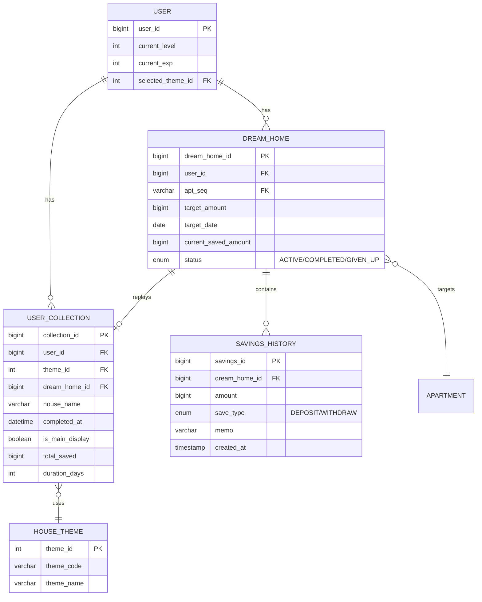

# Collection Feature PRD
## 완성된 집 컬렉션 및 저축 여정 리플레이 기능

---

## 1. 개요

### 1.1 배경
사용자는 저축 목표를 달성하여 집(DreamHome)을 완성할 때마다 성취감을 느낍니다. 현재 시스템에는 완성한 집을 모아보기 위한 `user_collection` 테이블이 존재하지만, (1) 목표 달성 시 자동 적재 로직과 (2) 사용자가 이를 다시 조회/회고하는 기능이 부족합니다.

### 1.2 목표
1. **Main Collection Gallery**: 클릭 시 새로운 화면으로 전환하여, 사용자가 저축하며 집을 완성해온 과정을 스크롤 애니메이션으로 리플레이할 수 있게 합니다.
2. **Grid of Mini CrystalBalls**: 그동안 완성한 모든 집들을 미리보기 형태로 그리드에 표시합니다.

### 1.3 참고 자료
- [furniture-animation.html](file:///c:/Users/gds05/OneDrive/바탕%20화면/jipjung/jipjung-frontend/furniture-animation.html) - GSAP ScrollTrigger 기반 스크롤 애니메이션 레퍼런스

---

## 2. 현재 시스템 분석

### 2.1 목표 데이터 모델 (TO-BE)

> [!NOTE]
> `user_collection`의 AS-IS 스키마는 5.1을 참고하고, 본 ERD는 본 PRD의 변경사항(예: `dream_home_id`)을 반영한 TO-BE 모델입니다.



### 2.2 현재 구현 상태

| 구성요소 | 파일 | 상태 |
|---------|------|------|
| CollectionView | `src/views/CollectionView.vue` | 기본 scaffold만 존재. 하드코딩된 placeholder 데이터 사용 |
| user_collection 테이블 | `schema-mysql.sql`, `schema-h2.sql` | 테이블 존재. `dream_home_id` FK/UNIQUE 및 자동 적재 로직은 미구현 |
| Collection API | 없음 | 백엔드 API 미구현 |
| 저축 히스토리 조회 | `SavingsHistoryMapper.xml` | 기본 조회만 가능. 리플레이용 집계 쿼리 없음 |

### 2.3 기존 컴포넌트 재사용 가능성

| 컴포넌트 | 용도 | 재사용 여부 |
|----------|------|------------|
| `CrystalBall.vue` | 미니 프리뷰 | ✅ 그대로 사용 가능 |
| `IsometricRoomHero.vue` | 집 렌더링 | ⚠️ 일부 로직 추출 필요 |
| `furniture-animation.html` | 스크롤 애니메이션 | ✅ Vue 컴포넌트로 포팅 |

---

## 3. 상세 요구사항

### 3.1 Main Collection Gallery (저축 여정 리플레이)

#### 3.1.1 진입점
- **위치**: `CollectionView.vue`의 Hero Crystal 영역
- **트리거**: Hero CrystalBall 클릭 시
- **동작**: 새로운 리플레이 뷰로 전환 (Vue Router를 통한 페이지 이동)

#### 3.1.2 저축 여정 리플레이 화면 (Cinematic Style 🎬)

집 이미지를 **화면의 80% 이상** 차지하도록 하여 몰입감을 극대화합니다.
저축 상세 정보는 **Bottom Sheet**를 통해 필요할 때만 표시합니다.

##### 메인 화면 (기본 상태)

```
┌─────────────────────────────────────────────────────────────┐
│  [←]                                                  [공유] │
├─────────────────────────────────────────────────────────────┤
│                                                               │
│                                                               │
│                                                               │
│                                                               │
│           ┌───────────────────────────────────────┐           │
│           │                                       │           │
│           │                                       │           │
│           │                                       │           │
│           │                                       │           │
│           │           🏠 집 이미지                │           │
│           │         (화면 중앙, 대형)             │ ← 80% 비중│
│           │          Phase 3: 외벽                │           │
│           │                                       │           │
│           │                                       │           │
│           │                                       │           │
│           │                                       │           │
│           └───────────────────────────────────────┘           │
│                                                               │
│                      ╭────────────────────╮                   │
│                      │  3단계 · 외벽 공사  │ ← 플로팅 뱃지     │
│                      │  "외벽을 올리는    │   (반투명 글래스)  │
│                      │    중이에요" 🧱    │                   │
│                      ╰────────────────────╯                   │
│                                                               │
│         ○ ─── ○ ─── ● ─── ○ ─── ○ ─── ○                      │
│        터파기  골조  [외벽]  지붕   마감   완성                 │
│                                                               │
│                 ↑ 위로 스와이프: 상세 보기                    │
│                                                               │
└─────────────────────────────────────────────────────────────┘
```

##### Bottom Sheet (위로 스와이프 시)

```
┌─────────────────────────────────────────────────────────────┐
│           (집 이미지 - 축소되어 상단에 고정)                   │
│           ┌─────────────────────┐                             │
│           │   🏠 (미니 뷰)       │ ← 40% 축소                  │
│           └─────────────────────┘                             │
├─────────────────────────────────────────────────────────────┤
│  ━━━━━━━━━━━━━━━━━  (드래그 핸들)                            │
│                                                               │
│  📊 외벽 공사 (3단계)                                         │
│  ──────────────────────────────────────────                   │
│  이 단계 동안 3회 저축 · 총 650만원                           │
│  기간: 2024.03.10 ~ 2024.03.20 (10일)                        │
│                                                               │
│  ┌──────────────────────────────────────────────────────┐    │
│  │  📅 2024.03.20  ·  💰 300만원                        │    │
│  │  "할 수 있다! 💪"                                    │    │
│  ├──────────────────────────────────────────────────────┤    │
│  │  📅 2024.03.15  ·  💰 200만원                        │    │
│  │  "월급날 꼬박꼬박 저축!"                              │    │
│  ├──────────────────────────────────────────────────────┤    │
│  │  📅 2024.03.10  ·  💰 150만원                        │    │
│  │  🎉 레벨업! 골조 → 외벽                              │    │
│  └──────────────────────────────────────────────────────┘    │
│                                                               │
│              ↓ 아래로 스와이프: 닫기                          │
│                                                               │
└─────────────────────────────────────────────────────────────┘
```

##### 완공 화면 (100% 스크롤 도달 시)

```
┌─────────────────────────────────────────────────────────────┐
│                                                               │
│                    🎉 축하합니다! 🎉                          │
│                                                               │
│           ┌───────────────────────────────────────┐           │
│           │                                       │           │
│           │                                       │           │
│           │         🏠 완성된 집 이미지           │           │
│           │          + Confetti 효과              │           │
│           │                                       │           │
│           │                                       │           │
│           └───────────────────────────────────────┘           │
│                                                               │
│                    강남 오피스텔 완공!                         │
│                                                               │
│  ┌──────────────────────────────────────────────────────┐    │
│  │     📅 152일      💰 25회 저축     🎯 5천만원       │    │
│  └──────────────────────────────────────────────────────┘    │
│                                                               │
│  ──────────── 획득한 성과 ────────────                       │
│                                                               │
│      🏅           🔥            💪            🎯             │
│    첫 번째 집   152일 꾸준히   25회 저축   목표 달성         │
│                                                               │
│  ────────────────────────────────────────                    │
│                                                               │
│   [🔗 공유하기]   [📸 이미지 저장]   [🏠 컬렉션으로]         │
│                                                               │
└─────────────────────────────────────────────────────────────┘
```

##### 인터랙션 정의

| 제스처/액션 | 동작 |
|------------|------|
| **세로 스크롤** | Phase 진행 (집 이미지 전환) |
| **위로 스와이프** | Bottom Sheet 열기 (저축 상세) |
| **아래로 스와이프** | Bottom Sheet 닫기 |
| **집 이미지 탭** | 현재 Phase 정보 토스트 표시 |
| **집 이미지 더블탭** | 완공 상태로 점프 |
| **Progress Dot 탭** | 해당 Phase로 이동 |
| **[공유] 버튼** | 공유 옵션 (이미지 저장, 링크 복사) |

##### 디자인 사양

| 요소 | 스펙 |
|------|------|
| 집 이미지 크기 | 화면 너비 80%, 최대 500px |
| 플로팅 뱃지 | `backdrop-filter: blur(10px)`, 반투명 배경 |
| Progress Dots | 지름 12px, 활성화 시 16px + glow |
| Bottom Sheet | 높이: 60vh, 드래그로 조절 가능 |
| 완공 Confetti | 3-5초 재생, 자동 종료 |

#### 3.1.3 스크롤 애니메이션 동작

저축 여정은 **2개의 Phase**로 구성됩니다:
- **Phase 1: 집 짓기** (6단계) - 터파기 → 완공
- **Phase 2: 가구 배치** (5단계) - 바닥 정돈 → 인테리어 완성

총 **11단계**의 여정을 스크롤로 리플레이합니다.

##### Phase 1: 집 짓기 (House Building) 🏗️

| 스크롤 구간 | 단계 | 이미지 상태 | 메시지 |
|------------|------|------------|--------|
| 0-9% | 1/11 | 터파기 | "꿈을 위한 첫 삽을 떴어요! 🌱" |
| 9-18% | 2/11 | 기초 공사 | "차근차근 기초를 다지고 있어요 🧱" |
| 18-27% | 3/11 | 골조 공사 | "공간이 조금씩 형태를 갖춰가요 🏗️" |
| 27-36% | 4/11 | 외벽 마감 | "어떤 집이 될지 기대되지 않나요? 🏠" |
| 36-45% | 5/11 | 지붕 공사 | "거의 다 왔어요! 마무리가 한창이에요 🎨" |
| 45-55% | 6/11 | 🏠 집 완공! | "드디어 완성! 따뜻한 온기로 채워주세요 🏡" |

```
───────── Phase 1 완료! ─────────
          🎉 집 완공 축하!
      "이제 방을 꾸밀 수 있어요"
         [인테리어 시작]
─────────────────────────────────
```

##### Phase 2: 가구 배치 (Furniture Placement) 🛋️

| 스크롤 구간 | 단계 | 이미지 상태 | 메시지 |
|------------|------|------------|--------|
| 55-64% | 7/11 | 바닥·벽 정돈 | "배경과 바닥을 깔끔하게 준비했어요 🎨" |
| 64-73% | 8/11 | 휴식 공간 | "소파가 들어와 거실이 만들어졌어요 🛋️" |
| 73-82% | 9/11 | 기능 더하기 | "테이블과 수납이 배치됐어요 🪑" |
| 82-91% | 10/11 | 분위기 완성 | "램프로 공간이 따뜻해졌어요 💡" |
| 91-100% | 11/11 | 🎊 완성! | "살고 싶은 집, 인테리어 끝! 🥳" |

##### 스크롤 전환 시각화

```
┌─────────────────────────────────────────────────────────────────┐
│                 전체 저축 여정 (11단계)                          │
├─────────────────────────────────────────────────────────────────┤
│                                                                   │
│  ────────── Phase 1: 집 짓기 (0-55%) ──────────                  │
│                                                                   │
│  ○ ── ○ ── ○ ── ○ ── ○ ── ● ── ┃ ── ○ ── ○ ── ○ ── ○ ── ○       │
│  터   기   골   외   지   완   ┃   바   휴   기   분   인       │
│  파   초   조   벽   붕   공   ┃   닥   식   능   위   테       │
│  기                            ┃       공       기   리       │
│                                ┃       간           어       │
│  ────────── Phase 2: 가구 배치 (55-100%) ──────────              │
│                                                                   │
│  [현재 위치: 집 완공 단계 🏠]                                    │
│                                                                   │
└─────────────────────────────────────────────────────────────────┘
```

##### 단계 전환 애니메이션

| 전환 타입 | 애니메이션 | 효과 |
|----------|-----------|------|
| Phase 1 → Phase 1 | 이미지 페이드 + 스케일 | 집 형태 변화 |
| Phase 1 → Phase 2 | 특별 축하 + 모달 | 🎉 집 완공 축하 |
| Phase 2 → Phase 2 | 레이어 팝인 | 가구 하나씩 추가 |
| Phase 2 완료 | Confetti + 배지 | 🥳 최종 완성 |

##### 가구 배치 레이어 시스템

Phase 2에서는 가구가 **레이어별로** 나타납니다:

```javascript
// 현재 구현 기준 (showroomWebp.js 참조)
const FURNITURE_LAYERS = [
  { id: 'background', stage: 1 },  // 바닥·벽 정돈
  { id: 'sofa', stage: 2 },        // 휴식 공간 (소파)
  { id: 'tables', stage: 3 },      // 기능 더하기 (테이블)
  { id: 'lamp', stage: 4 },        // 분위기 완성 (램프)
  { id: 'reze', stage: 5 }         // 디테일 (소품)
]
```

#### 3.1.4 데이터 요구사항

각 phase에 표시할 데이터:
- **날짜**: 해당 단계에 도달한 날짜 (savings_history.created_at)
- **저축 금액**: 누적 저축 금액
- **이벤트 타입**: DEPOSIT, LEVEL_UP, PHASE_COMPLETE, FURNITURE_UNLOCKED
- **메모**: 사용자가 남긴 저축 메모 또는 시스템 메시지
- **트랙**: 'house' 또는 'furniture' (Phase 구분)

##### 이벤트 타입 정의

| 타입 | 설명 | 표시 예시 |
|------|------|----------|
| `DEPOSIT` | 일반 저축 | "💰 300,000원 저축" |
| `WITHDRAW` | 인출 | "📤 100,000원 인출" |
| `LEVEL_UP` | 단계 상승 | "🎉 레벨업! 골조 공사 시작" |
| `HOUSE_COMPLETE` | 집 완공 | "🏠 드디어 집 완공!" |
| `FURNITURE_UNLOCKED` | 가구 레이어 해금 | "🛋️ 소파가 들어왔어요!" |
| `JOURNEY_COMPLETE` | 최종 완성 | "🥳 인테리어까지 완성!" |

##### 여정 이벤트 규칙 (중요)

> [!IMPORTANT]
> **단계 진행은 단방향입니다.** WITHDRAW(인출)가 있어도 단계가 되돌아가지 않습니다.

| 규칙 | 설명 |
|------|------|
| **단방향 진행** | 단계는 최고치 기준. WITHDRAW로 금액이 줄어도 이미 도달한 단계 유지 |
| **다중 단계 점프** | 한 번의 입금으로 여러 단계 건너뛰면, 각 단계마다 `LEVEL_UP` 이벤트 생성 |
| **WITHDRAW 표시** | 리플레이에 표시하되, 별도 이모지(📤)로 구분. 해당 단계에 포함 |
| **단계 경계 계산** | `targetAmount / 11` per stage (집 6단계 + 가구 5단계) |

**다중 단계 점프 예시:**
```
저축 전: 500만원 (2단계)
저축액: 2,000만원 (한 번에 큰 입금)
저축 후: 2,500만원 (5단계)

→ 생성되는 이벤트:
  1. LEVEL_UP: 3단계 도달
  2. LEVEL_UP: 4단계 도달
  3. LEVEL_UP: 5단계 도달
  4. DEPOSIT: 2,000만원 저축
```

##### 누적합 쿼리 최적화

> [!TIP]
> 서브쿼리 방식은 데이터가 커지면 느립니다. **윈도우 함수** 사용을 권장합니다.

```sql
-- ❌ 비효율적 (행마다 SUM 서브쿼리)
SELECT 
    sh.*,
    (SELECT SUM(amount) FROM savings_history 
     WHERE dream_home_id = sh.dream_home_id 
       AND created_at <= sh.created_at) as cumulative_total
FROM savings_history sh;

-- ✅ 권장 (MySQL 8.0+ 윈도우 함수)
SELECT 
    sh.*,
    SUM(CASE WHEN save_type = 'DEPOSIT' THEN amount ELSE -amount END) 
        OVER (PARTITION BY dream_home_id ORDER BY created_at) as cumulative_total
FROM savings_history sh
WHERE dream_home_id = #{dreamHomeId} AND is_deleted = FALSE
ORDER BY created_at ASC;
```

##### 이미지 URL 분리 설계

> [!TIP]
> 백엔드는 `themeCode` + `stageNumber`만 반환하고, URL 조립은 프론트에서 수행합니다. (컬렉션 목록의 썸네일도 동일)
> 이렇게 하면 프론트의 `/public/webp` 구조가 변경되어도 백엔드 수정이 불필요합니다.

**API 응답 설계 (변경):**
```json
{
  "phases": [
    {
      "phaseNumber": 1,
      "phaseName": "터파기",
      "themeCode": "CLASSIC",      // ← themeCode만 반환
      "stageNumber": 1,            // ← stageNumber만 반환
      // "phaseImageUrl": "/webp/classic/stage1.webp"  ← 제거
      "reachedAt": "2024-01-15T14:30:00",
      "cumulativeAmount": 1000000
    }
  ]
}
```

**프론트엔드 URL 조립:**
```javascript
// showroomWebp.js 활용
import { getExteriorStageUrl, getInteriorLayerUrls } from '@/constants/showroomWebp'

const imageUrl = isHousePhase 
  ? getExteriorStageUrl(phase.themeCode, phase.stageNumber)
  : getInteriorLayerUrls(phase.themeCode)[phase.stageNumber - 1]?.url
```

### 3.2 Grid of Mini CrystalBalls (완성된 집 목록)

#### 3.2.1 그리드 표시

```
┌─────────────────────────────────────────────────────────────┐
│                    저장된 컬렉션                              │
├─────────────────────────────────────────────────────────────┤
│                                                               │
│   ┌──────┐    ┌──────┐    ┌──────┐                          │
│   │ 🏠   │    │ 🏠   │    │ 🏠   │                          │
│   │      │    │      │    │      │                          │
│   └──────┘    └──────┘    └──────┘                          │
│   강남 오피스텔  해운대 아파트   제주 타운하우스                │
│   2024.06완공    2024.03완공    2023.12완공                   │
│                                                               │
│   ┌──────┐    ┌──────┐    ┌ ─ ─ ─ ─ ┐                        │
│   │ 🏠   │    │ 🏠   │    │ + 추가   │  ← Empty Slot          │
│   │      │    │      │    │ 예정    │                        │
│   └──────┘    └──────┘    └ ─ ─ ─ ─ ┘                        │
│   분당 단독     송도 빌라                                     │
│   2023.09완공   2023.06완공                                   │
│                                                               │
└─────────────────────────────────────────────────────────────┘
```

#### 3.2.2 각 미니 카드에 표시할 정보

| 필드 | 설명 | 소스 |
|------|------|------|
| 집 이미지 | 완성된 테마의 최종 단계(6단계) 이미지 | `themeCode` + `previewStageNumber=6` (URL은 프론트 조립) |
| 매물명 | 아파트 이름 | apartment.apt_nm (via dream_home) |
| 위치 | 지역 정보 | dongcode.gugun_name |
| 완공일 | 목표 달성일 | user_collection.completed_at |
| 저축 기간 | 시작~완공 기간 | dream_home.start_date ~ completed_at |
| 최종 금액 | 달성한 목표 금액 | dream_home.target_amount |

#### 3.2.3 상호작용

1. **미니 카드 클릭** → 해당 집의 저축 여정 리플레이 화면으로 이동
2. **대표 컬렉션 설정** → `is_main_display = true` 토글 (대시보드 Hero에 표시)
3. **Empty State** → 현재 진행 중인 드림홈이 있으면 "곧 추가될 예정" 표시

---

## 4. API 설계

### 4.1 신규 API 엔드포인트

#### 4.1.1 GET /api/collection

완성된 집 목록 조회

**Request**
```http
GET /api/collection HTTP/1.1
Authorization: Bearer {token}
```

**Response**
```json
{
  "collections": [
    {
      "collectionId": 1,
      "themeId": 1,
      "themeName": "모던 아파트",
      "themeCode": "CLASSIC",
      "previewStageNumber": 6,
      "dreamHomeId": 10,
      "propertyName": "강남 오피스텔",
      "location": "서울 강남구",
      "targetAmount": 50000000,
      "savingPeriodDays": 180,
      "completedAt": "2024-06-15T10:30:00",
      "isMainDisplay": true
    },
    ...
  ],
  "totalCount": 5,
  "activeGoalExists": true
}
```

#### 4.1.2 GET /api/collection/{collectionId}/journey

저축 여정 상세 조회 (리플레이용)

**Request**
```http
GET /api/collection/1/journey HTTP/1.1
Authorization: Bearer {token}
```

**Response**
```json
{
  "collection": {
    "collectionId": 1,
    "themeName": "모던 아파트",
    "propertyName": "강남 오피스텔",
    "location": "서울 강남구"
  },
  "summary": {
    "startDate": "2024-01-15",
    "completedDate": "2024-06-15",
    "totalDays": 152,
    "totalDeposits": 25,
    "targetAmount": 50000000
  },
  "phases": [
    {
      "phaseNumber": 1,
      "phaseName": "터파기",
      "themeCode": "CLASSIC",
      "stageNumber": 1,
      "reachedAt": "2024-01-15T14:30:00",
      "cumulativeAmount": 1000000,
      "events": [
        {
          "eventId": 1,
          "eventType": "DEPOSIT",
          "date": "2024-01-15",
          "amount": 500000,
          "memo": "드디어 시작! 💪",
          "cumulativeTotal": 500000
        },
        {
          "eventId": 2,
          "eventType": "DEPOSIT",
          "date": "2024-01-20",
          "amount": 500000,
          "memo": "월급날 저축",
          "cumulativeTotal": 1000000
        }
      ]
    },
    {
      "phaseNumber": 2,
      "phaseName": "골조 공사",
      "themeCode": "CLASSIC",
      "stageNumber": 2,
      "reachedAt": "2024-02-10T09:15:00",
      "cumulativeAmount": 5000000,
      "events": [...]
    },
    ...
  ]
}
```

#### 4.1.3 PUT /api/collection/{collectionId}/main-display

대표 컬렉션 설정

**Request**
```http
PUT /api/collection/1/main-display HTTP/1.1
Authorization: Bearer {token}
Content-Type: application/json

{
  "isMainDisplay": true
}
```

**Response**
```json
{
  "success": true,
  "collectionId": 1,
  "isMainDisplay": true
}
```

### 4.2 기존 API 수정

#### 4.2.1 POST /api/dream-home/savings 수정

> [!NOTE]
> 실제 API 경로는 `POST /api/dream-home/savings` 입니다. (DreamHomeController.java:82)

저축 기록 시 목표 달성(COMPLETED) 처리 로직에 `user_collection` 테이블 자동 인서트 추가

```java
// DreamHomeService.java - checkAndUpdateCompletion() 메서드 수정
private boolean checkAndUpdateCompletion(DreamHome dreamHome, long newSavedAmount, Long userId) {
    long targetAmount = nullToZero(dreamHome.getTargetAmount());
    boolean isCompleted = newSavedAmount >= targetAmount;

    if (!isCompleted) {
        return false;
    }

    // 1. 드림홈 상태 업데이트 (COMPLETED로 전이 시도)
    dreamHomeMapper.updateStatus(dreamHome.getDreamHomeId(), COMPLETED);

    // 2. user_collection 자동 등록 (멱등성: UNIQUE(dream_home_id) + DuplicateKeyException 무시)
    try {
        User user = userMapper.findById(userId);
        String houseName = apartmentMapper.findByAptSeqWithDeals(dreamHome.getAptSeq())
            .map(Apartment::getAptNm)
            .orElse(null);

        collectionMapper.insert(UserCollection.builder()
            .userId(userId)
            .themeId(user.getSelectedThemeId())
            .dreamHomeId(dreamHome.getDreamHomeId())
            .houseName(houseName)
            .totalSaved(newSavedAmount)
            .durationDays(calculateDurationDays(dreamHome.getStartDate()))
            .completedAt(LocalDateTime.now())
            .isMainDisplay(false)
            .build());
    } catch (DuplicateKeyException e) {
        log.debug("Collection already exists for dreamHomeId: {}", dreamHome.getDreamHomeId());
    }

    return true;
}
```

---

## 5. 데이터베이스 변경사항

> [!IMPORTANT]
> **스키마 소스 (Source of Truth)**: `schema-mysql.sql` 파일을 기준으로 합니다.
> `new-schema.sql`은 설계 문서용이며, 실제 런타임 스키마는 `schema-mysql.sql` 입니다.

### 5.1 user_collection 테이블 현재 상태 (schema-mysql.sql:270)

```sql
CREATE TABLE user_collection (
    collection_id BIGINT AUTO_INCREMENT PRIMARY KEY,
    user_id BIGINT NOT NULL,
    theme_id INT NOT NULL,
    house_name VARCHAR(100) COMMENT '유저가 붙인 집 이름',
    completed_at TIMESTAMP DEFAULT CURRENT_TIMESTAMP COMMENT '완공 날짜',
    is_main_display BOOLEAN DEFAULT FALSE COMMENT '대표 전시 여부',
    total_saved BIGINT COMMENT '완공까지 모은 총액',
    duration_days INT COMMENT '완공까지 걸린 일수',

    FOREIGN KEY (user_id) REFERENCES `user`(user_id) ON DELETE CASCADE,
    FOREIGN KEY (theme_id) REFERENCES house_theme(theme_id) ON DELETE CASCADE,
    INDEX idx_collection_user (user_id)
);
```

### 5.2 필요한 스키마 변경

```sql
-- 1. dream_home_id FK 추가 + UNIQUE 제약 (멱등성 보장)
ALTER TABLE user_collection 
ADD COLUMN dream_home_id BIGINT AFTER theme_id,
ADD CONSTRAINT fk_collection_dreamhome 
    FOREIGN KEY (dream_home_id) REFERENCES dream_home(dream_home_id),
ADD CONSTRAINT uk_collection_dreamhome 
    UNIQUE (dream_home_id);  -- 중복 INSERT 방지 (멱등성)

-- 2. 기존 데이터 마이그레이션 (COMPLETED 상태인 dream_home 기준)
INSERT IGNORE INTO user_collection 
    (user_id, theme_id, dream_home_id, house_name, total_saved, duration_days, completed_at)
SELECT 
    dh.user_id,
    COALESCE(u.selected_theme_id, 1),
    dh.dream_home_id,
    a.apt_nm,
    dh.current_saved_amount,
    DATEDIFF(dh.updated_at, dh.start_date),
    dh.updated_at
FROM dream_home dh
JOIN `user` u ON dh.user_id = u.user_id
JOIN apartment a ON dh.apt_seq = a.apt_seq
WHERE dh.status = 'COMPLETED' AND dh.is_deleted = FALSE
ON DUPLICATE KEY UPDATE dream_home_id = VALUES(dream_home_id);
```

### 5.3 is_main_display 유일성 보장

유저당 `is_main_display = true`인 컬렉션은 **1개만** 허용:

```java
// CollectionService.java
@Transactional
public void setMainDisplay(Long userId, Long collectionId) {
    // 1. 해당 컬렉션이 로그인 사용자 소유인지 확인 (IDOR 방지)
    UserCollection collection = collectionMapper.findById(collectionId);
    if (collection == null || !collection.getUserId().equals(userId)) {
        throw new BusinessException(ErrorCode.COLLECTION_NOT_FOUND);
    }
    
    // 2. 기존 대표 컬렉션 해제 → 새 대표 설정 (원자적 트랜잭션)
    collectionMapper.clearMainDisplay(userId);  // UPDATE SET is_main_display = false WHERE user_id = ?
    collectionMapper.setMainDisplay(collectionId);  // UPDATE SET is_main_display = true WHERE collection_id = ?
}
```

### 5.4 IDOR (Insecure Direct Object Reference) 보안

> [!CAUTION]
> `GET /api/collection/{collectionId}/journey`, `PUT .../main-display` API는  
> 반드시 **로그인 사용자 소유 여부를 검증**해야 합니다.

```java
// CollectionService.java - 소유권 검증 공통 메서드
private UserCollection validateOwnership(Long userId, Long collectionId) {
    UserCollection collection = collectionMapper.findById(collectionId);
    if (collection == null) {
        throw new BusinessException(ErrorCode.COLLECTION_NOT_FOUND);
    }
    if (!collection.getUserId().equals(userId)) {
        throw new BusinessException(ErrorCode.COLLECTION_ACCESS_DENIED);  // 403
    }
    return collection;
}

// Journey API에서 사용
public JourneyResponse getJourney(Long userId, Long collectionId) {
    UserCollection collection = validateOwnership(userId, collectionId);
    // ... 여정 데이터 조회
}
```

### 5.5 savings_history 테이블 수정 (선택)

리플레이 시 '레벨업' 이벤트 표시를 위해 이벤트 타입 확장 고려:

```sql
-- 옵션 1: 별도 컬럼 추가
ALTER TABLE savings_history 
ADD COLUMN triggered_level_up BOOLEAN DEFAULT FALSE,
ADD COLUMN level_at_time INT DEFAULT NULL;

-- 옵션 2: 별도 테이블 (level_up_history) - 현재 이미 exp 관련 로직 존재
-- 기존 streak_history 또는 신규 테이블 활용
```

> [!NOTE]
> 현재 레벨업 정보는 User 테이블의 current_level만 존재합니다. 
> 히스토리 추적을 위해 별도 테이블이 필요할 수 있습니다.

---

## 6. 프론트엔드 구현 계획

### 6.1 신규 컴포넌트

| 컴포넌트 | 경로 | 설명 |
|----------|------|------|
| `JourneyReplayView.vue` | `src/views/JourneyReplayView.vue` | 저축 여정 리플레이 페이지 |
| `JourneyPhaseCard.vue` | `src/components/collection/JourneyPhaseCard.vue` | 각 단계별 이벤트 카드 |
| `JourneyProgress.vue` | `src/components/collection/JourneyProgress.vue` | 진행 표시 (Dots + Message) |
| `CollectionMiniCard.vue` | `src/components/collection/CollectionMiniCard.vue` | 그리드용 미니 카드 |

### 6.2 수정 컴포넌트

| 컴포넌트 | 변경 내용 |
|----------|----------|
| `CollectionView.vue` | API 연동, 클릭 이벤트 핸들링 추가 |
| `router/index.js` | `/collection/:id/journey` 라우트 추가 |

### 6.3 신규 API 서비스

```javascript
// src/api/services/collectionService.js

export const collectionService = {
  /**
   * 완성된 집 목록 조회
   */
  getCollections() {
    return apiClient.get('/api/collection')
  },

  /**
   * 저축 여정 상세 조회
   * @param {number} collectionId
   */
  getJourney(collectionId) {
    return apiClient.get(`/api/collection/${collectionId}/journey`)
  },

  /**
   * 대표 컬렉션 설정
   * @param {number} collectionId
   * @param {boolean} isMainDisplay
   */
  setMainDisplay(collectionId, isMainDisplay) {
    return apiClient.put(`/api/collection/${collectionId}/main-display`, {
      isMainDisplay
    })
  }
}
```

### 6.4 GSAP ScrollTrigger 구현

`furniture-animation.html`의 로직을 Vue Composition API로 포팅:

```javascript
// useJourneyAnimation.js (Composable)
import { onMounted, onUnmounted, ref } from 'vue'
import gsap from 'gsap'
import { ScrollTrigger } from 'gsap/ScrollTrigger'

export function useJourneyAnimation(containerRef, phases) {
  const currentPhase = ref(0)
  const progressMessage = ref('준비 중...')

  onMounted(() => {
    gsap.registerPlugin(ScrollTrigger)
    
    const timeline = gsap.timeline({
      scrollTrigger: {
        trigger: containerRef.value,
        start: 'top top',
        end: '+=4000',
        scrub: 1,
        pin: true,
        onUpdate: (self) => {
          const progress = self.progress
          const phaseIndex = Math.min(
            Math.floor(progress * phases.length),
            phases.length - 1
          )
          currentPhase.value = phaseIndex
          progressMessage.value = phases[phaseIndex]?.phaseName || ''
        }
      }
    })
    
    // Phase별 이미지 전환 애니메이션 추가
    phases.forEach((phase, index) => {
      const position = (index / phases.length) * 100
      timeline.to(`#phase-${index}`, {
        opacity: 1,
        scale: 1,
        duration: 0.8,
        ease: 'power2.out'
      }, position + '%')
    })
  })

  onUnmounted(() => {
    ScrollTrigger.getAll().forEach(trigger => trigger.kill())
  })

  return { currentPhase, progressMessage }
}
```

---

## 7. 백엔드 구현 계획

### 7.1 신규 파일

| 파일 | 경로 | 설명 |
|------|------|------|
| `CollectionController.java` | `controller/` | Collection API 엔드포인트 |
| `CollectionService.java` | `service/` | 비즈니스 로직 |
| `CollectionMapper.java` | `repository/` | MyBatis Mapper 인터페이스 |
| `CollectionMapper.xml` | `resources/mapper/` | SQL 쿼리 |
| `UserCollection.java` | `domain/` | 도메인 객체 |
| `CollectionResponse.java` | `controller/dto/response/` | API 응답 DTO |
| `JourneyResponse.java` | `controller/dto/response/` | 여정 상세 응답 DTO |

### 7.2 수정 파일

| 파일 | 변경 내용 |
|------|----------|
| `DreamHomeService.java` | 목표 달성 시 user_collection 자동 등록 |
| `SavingsHistoryMapper.xml` | 여정 조회용 쿼리 추가 |

### 7.3 주요 쿼리

```xml
<!-- CollectionMapper.xml -->

<!-- 사용자의 완성된 집 목록 조회 -->
<select id="findByUserId" resultType="CollectionWithDetails">
    SELECT 
        uc.collection_id,
        uc.theme_id,
        ht.theme_name,
        ht.theme_code,
        uc.dream_home_id,
        a.apt_nm as property_name,
        CONCAT(d.gugun_name, ' ', COALESCE(d.dong_name, '')) as location,
        dh.target_amount,
        DATEDIFF(uc.completed_at, dh.start_date) as saving_period_days,
        uc.completed_at,
        uc.is_main_display
    FROM user_collection uc
    JOIN house_theme ht ON uc.theme_id = ht.theme_id
    JOIN dream_home dh ON uc.dream_home_id = dh.dream_home_id
    JOIN apartment a ON dh.apt_seq = a.apt_seq
    JOIN dongcode d ON a.dong_code = d.dong_code
    WHERE uc.user_id = #{userId}
    ORDER BY uc.completed_at DESC
</select>

<!-- 저축 여정 상세 조회 (Phase별 이벤트 포함) -->
<select id="findJourneyByCollectionId" resultMap="JourneyResultMap">
    SELECT 
        sh.savings_id,
        sh.amount,
        sh.save_type,
        sh.memo,
        sh.created_at,
        SUM(CASE WHEN sh.save_type = 'DEPOSIT' THEN sh.amount ELSE -sh.amount END)
            OVER (PARTITION BY sh.dream_home_id ORDER BY sh.created_at) as cumulative_total
    FROM savings_history sh
    WHERE sh.dream_home_id = #{dreamHomeId}
      AND sh.is_deleted = FALSE
    ORDER BY sh.created_at ASC
</select>
```

---

## 8. 검증 계획

### 8.1 자동화 테스트

#### 8.1.1 백엔드 단위 테스트

```bash
# 실행 명령어
cd jipjung-backend
./mvnw test -Dtest=CollectionServiceTest
```

테스트 케이스:
- [ ] `getCollections_사용자의_완성된_집_목록_조회`
- [ ] `getJourney_저축_여정_Phase별_그룹핑_확인`
- [ ] `setMainDisplay_대표_컬렉션_설정_성공`
- [ ] `완료된_드림홈_저장시_자동_컬렉션_등록`

#### 8.1.2 프론트엔드 컴포넌트 테스트

현재 프론트엔드 테스트 설정이 없으므로 수동 검증 또는 E2E 테스트 권장

### 8.2 수동 검증

#### 8.2.1 Collection 목록 화면 검증

| 단계 | 액션 | 예상 결과 |
|------|------|----------|
| 1 | `/collection` 페이지 접속 | 완성된 집 목록이 그리드로 표시됨 |
| 2 | 미니 카드 호버 | 호버 효과 (scale, shadow 변화) |
| 3 | 미니 카드 클릭 | 해당 집의 저축 여정 리플레이 페이지로 이동 |

#### 8.2.2 저축 여정 리플레이 검증

| 단계 | 액션 | 예상 결과 |
|------|------|----------|
| 1 | 리플레이 페이지 진입 | Phase 1 이미지와 첫 저축 이벤트 표시 |
| 2 | 20% 스크롤 | Phase 2로 전환, Progress Dot 2 활성화 |
| 3 | 50% 스크롤 | Phase 3-4 사이, 중간 마일스톤 표시 |
| 4 | 100% 스크롤 | Phase 6 (완성), "🎉 완공!" 메시지 |
| 5 | 뒤로가기 | Collection 목록으로 정상 복귀 |

#### 8.2.3 데이터 정합성 검증

```sql
-- 검증 쿼리: 완료된 드림홈과 컬렉션 데이터 일치 확인
SELECT 
    dh.dream_home_id,
    dh.status,
    uc.collection_id
FROM dream_home dh
LEFT JOIN user_collection uc ON dh.dream_home_id = uc.dream_home_id
WHERE dh.status = 'COMPLETED' AND dh.is_deleted = FALSE;

-- 모든 COMPLETED 드림홈에 대응하는 collection이 있어야 함
```

---

## 9. 일정 및 우선순위

### Phase 1: 백엔드 API 구현 (2-3일)
1. [ ] `user_collection` 테이블 스키마 수정 (dream_home_id FK 추가)
2. [ ] `UserCollection.java` 도메인 생성
3. [ ] `CollectionMapper` 인터페이스 및 XML 작성
4. [ ] `CollectionService` 비즈니스 로직
5. [ ] `CollectionController` API 엔드포인트
6. [ ] `DreamHomeService` 수정 (목표 달성 시 자동 등록)

### Phase 2: 프론트엔드 Collection 목록 (2일)
1. [ ] `collectionService.js` API 서비스
2. [ ] `CollectionView.vue` API 연동
3. [ ] `CollectionMiniCard.vue` 컴포넌트

### Phase 3: 저축 여정 리플레이 (3-4일)
1. [ ] `JourneyReplayView.vue` 페이지
2. [ ] GSAP ScrollTrigger 연동
3. [ ] `JourneyPhaseCard.vue` 컴포넌트
4. [ ] `JourneyProgress.vue` 컴포넌트
5. [ ] 라우터 설정

### Phase 4: 테스트 및 폴리싱 (1-2일)
1. [ ] 백엔드 단위 테스트
2. [ ] E2E 또는 수동 검증
3. [ ] 애니메이션 튜닝

---

## 10. 리스크 및 고려사항

### 10.1 데이터 마이그레이션

> [!WARNING]
> 기존에 `status = 'COMPLETED'`인 dream_home에 대해 user_collection 레코드가 없을 수 있음.
> 마이그레이션 스크립트 실행 필요.

### 10.2 레벨업 히스토리 부재

현재 시스템에서 레벨업 시점을 별도로 기록하지 않아, 리플레이 시 정확한 레벨업 타이밍 표시가 어려울 수 있음.

**대안**:
- 저축 금액 기준으로 Phase 경계 계산 (targetAmount / 6 per phase)
- 또는 레벨업 히스토리 테이블 신규 추가

### 10.3 테마 이미지 Phase별 분리

현재 프로젝트는 **로컬 WebP 파일**을 사용합니다. (`public/webp/` 폴더)

**저장 구조:**
```
public/webp/
├── classic/           # 클래식 테마
│   ├── stage1.webp ~ stage6.webp
├── classic_interior/  # 클래식 인테리어 레이어
│   ├── background.webp, sofa.webp, table.webp, lamp.webp, reze.webp
├── hanok/             # 한옥 테마  
│   ├── stage1.webp ~ stage6.webp
├── hanok_interior/
│   └── ...
├── santorini/         # 산토리니 테마
│   ├── stage1.webp ~ stage6.webp
└── santorini_interior/
    └── ...
```

**URL 생성 로직:** (`showroomWebp.js`)
```javascript
// 집 짓기 이미지
getExteriorStageUrl('CLASSIC', 3)  // → "/webp/classic/stage3.webp"

// 인테리어 레이어
getInteriorLayerUrls('HANOK')  // → [{ id: 'background', url: '/webp/hanok_interior/background.webp' }, ...]
```

> [!NOTE]
> 모든 테마(CLASSIC, HANOK, SANTORINI)에 대해 6단계 이미지 + 인테리어 레이어가 준비되어 있습니다.

---

## 11. 미해결 질문 (User Review Required)

1. **레벨업 히스토리 추적**: 정확한 레벨업 시점을 기록하는 별도 테이블을 추가할지, 저축 금액 기준 추정으로 대체할지?

2. **Empty State 디자인**: 완성된 집이 없는 사용자에게 어떤 안내 메시지를 표시할지? (예: "첫 번째 집을 완성해보세요!")

3. **대표 컬렉션 활용**: `is_main_display = true`인 컬렉션을 대시보드 Hero에 표시할 때, 현재 진행 중인 드림홈과 어떻게 구분/전환할지?

4. **저축 여정 공유 기능**: 완성한 저축 여정을 SNS 등에 공유하는 기능이 필요한지?

---

## 12. 참고 파일

| 파일 | 설명 |
|------|------|
| [furniture-animation.html](file:///c:/Users/gds05/OneDrive/바탕%20화면/jipjung/jipjung-frontend/furniture-animation.html) | GSAP ScrollTrigger 레퍼런스 |
| [CollectionView.vue](file:///c:/Users/gds05/OneDrive/바탕%20화면/jipjung/jipjung-frontend/src/views/CollectionView.vue) | 현재 Collection 페이지 |
| [schema-mysql.sql](file:///c:/Users/gds05/OneDrive/바탕%20화면/jipjung/jipjung-backend/src/main/resources/schema-mysql.sql) | 런타임 DB 스키마 (Source of Truth) |
| [schema-h2.sql](file:///c:/Users/gds05/OneDrive/바탕%20화면/jipjung/jipjung-backend/src/main/resources/schema-h2.sql) | 테스트(H2) 스키마 |
| [new-schema.sql](file:///c:/Users/gds05/OneDrive/바탕%20화면/jipjung/jipjung-backend/docs/new-schema.sql) | 설계 문서용 스키마 (참고) |
| [DreamHomeService.java](file:///c:/Users/gds05/OneDrive/바탕%20화면/jipjung/jipjung-backend/src/main/java/com/jipjung/project/service/DreamHomeService.java) | 드림홈 서비스 |
| [gamificationStore.js](file:///c:/Users/gds05/OneDrive/바탕%20화면/jipjung/jipjung-frontend/src/stores/gamificationStore.js) | 게임화 상태 관리 |

---

## 13. UI/UX 전문가 리뷰 🎨

> **리뷰어**: UI/UX 전문가 & 시니어 프로덕트 디자이너 페르소나
> **리뷰 날짜**: 2024-12-17
> **리뷰 범위**: 전체 PRD에 대한 디자인 관점 피드백

---

### 13.1 전반적인 평가

| 항목 | 점수 (5점 만점) | 코멘트 |
|------|----------------|--------|
| 기능 명확성 | ⭐⭐⭐⭐⭐ | 요구사항이 명확하게 정의됨 |
| 사용자 여정 고려 | ⭐⭐⭐☆☆ | 감정적 터치포인트 보완 필요 |
| 마이크로인터랙션 | ⭐⭐☆☆☆ | 상세 인터랙션 명세 부족 |
| 접근성 | ⭐⭐☆☆☆ | A11y 고려사항 누락 |
| 모바일 UX | ⭐⭐☆☆☆ | 터치 인터랙션 상세화 필요 |

---

### 13.2 부족한 부분 및 개선 피드백


#### 13.2.2 🔄 마이크로인터랙션 상세화 필요

**현재 문제점:**
- GSAP 애니메이션은 언급되었으나, 세부 타이밍/이징 명세 부족
- 상태 전환 시 사용자 피드백 미정의

**개선 제안:**

| 인터랙션 | 현재 | 추가해야 할 상세 스펙 |
|----------|------|----------------------|
| Phase 전환 | opacity 변화 | `scale: 0.95→1.0`, `y: 20→0`, `ease: "elastic.out(1, 0.5)"` |
| 집 이미지 나타남 | 미정의 | Drop-in 효과 + 그림자 부드럽게 생성 |
| Progress Dot 활성화 | 미정의 | `scale: 1→1.35→1.2`, glow 효과 `0 0 14px rgba(...)` |
| 타임라인 카드 | 미정의 | 스크롤에 따라 fade-in + slide-up (stagger 0.1s) |
| 완공 축하 | 미정의 | 3단계: ① 집 포커스 ② Confetti burst ③ 배지 팝업 |

**권장 이징 함수:**
```javascript
const EASING_PRESETS = {
  // 집 이미지 전환: 살짝 튕기는 느낌
  houseTransition: "elastic.out(1, 0.75)",
  
  // 카드 나타남: 부드러운 감속
  cardReveal: "power3.out",
  
  // 버튼 호버: 빠른 반응
  buttonHover: "power2.out",
  
  // 완공 축하: 활기찬 느낌
  celebration: "back.out(1.7)"
}
```

#### 13.2.3 ♿ 접근성 (Accessibility) 고려사항 누락

**현재 문제점:**
- 스크롤 기반 애니메이션은 모션 민감 사용자에게 문제 유발 가능
- 키보드 네비게이션 미정의
- 스크린 리더 지원 미언급

**개선 제안:**

```html
<!-- 필수 추가 요소 -->

<!-- 1. 모션 감소 선호 대응 -->
<style>
@media (prefers-reduced-motion: reduce) {
  .journey-animation { animation: none !important; }
  .scroll-trigger { scroll-behavior: auto; }
}
</style>

<!-- 2. 키보드 네비게이션 -->
<div 
  role="region" 
  aria-label="저축 여정 리플레이"
  tabindex="0"
  @keydown.left="previousPhase"
  @keydown.right="nextPhase"
>
  <!-- 키보드로 Phase 전환 가능 (←/→ 화살표) -->
</div>

<!-- 3. 스크린 리더용 라이브 영역 -->
<div aria-live="polite" class="sr-only">
  {{ currentPhaseName }} 단계입니다. 
  누적 저축 {{ cumulativeAmount }}원.
</div>

<!-- 4. 건너뛰기 버튼 -->
<button class="skip-animation" @click="skipToEnd">
  애니메이션 건너뛰기
</button>
```

#### 13.2.4 📱 모바일 UX 상세화 필요

**현재 문제점:**
- ASCII 와이어프레임이 데스크톱 중심
- 터치 제스처 정의 없음
- 모바일에서 스크롤 트리거 사용성 검증 필요

**개선 제안:**

```
┌─────────────────────────────────────────────────────────────────┐
│                    📱 모바일 저축 여정 리플레이                   │
├─────────────────────────────────────────────────────────────────┤
│                                                                   │
│  ┌─────────────────────────────────────────┐                      │
│  │         [← 뒤로]  저축 여정              │ ← 상단 고정          │
│  └─────────────────────────────────────────┘                      │
│                                                                   │
│           ┌─────────────────────┐                                 │
│           │                     │                                 │
│           │     집 이미지       │  ← 화면 상단 40% 고정           │
│           │     (Phase N)       │                                 │
│           │                     │                                 │
│           └─────────────────────┘                                 │
│                                                                   │
│           ● ─ ● ─ ○ ─ ○ ─ ○ ─ ○                                  │
│              "골조 공사 중 🏗️"                                    │
│                                                                   │
│  ──────────── 스크롤 영역 ────────────                           │
│                                                                   │
│  ┌───────────────────────────────────────┐                        │
│  │  📅 2024.03.15                        │                        │
│  │  첫 저축! 100,000원 저축              │  ← 스와이프로 넘기기   │
│  │  "드디어 시작! 💪"                    │     지원 고려          │
│  └───────────────────────────────────────┘                        │
│                                                                   │
│  ┌───────────────────────────────────────┐                        │
│  │  📅 2024.03.20  [레벨업!]             │                        │
│  │  500,000원 달성 🎉                    │                        │
│  └───────────────────────────────────────┘                        │
│                                                                   │
│                    ↓ 스크롤하여 더 보기 ↓                         │
│                                                                   │
└─────────────────────────────────────────────────────────────────┘
```

**모바일 터치 제스처:**

| 제스처 | 동작 |
|--------|------|
| 스크롤 | Phase 진행 (기존 유지) |
| 좌/우 스와이프 | Phase 빠른 이동 (대안) |
| 집 이미지 탭 | 현재 Phase 정보 모달 |
| 롱프레스 (집 이미지) | 공유 옵션 표시 |
| 더블탭 | 완공 상태로 점프 |


#### 13.2.6 🎨 비주얼 디자인 시스템 일관성

**현재 문제점:**
- Collection 페이지와 기존 대시보드 간 디자인 연결성 미언급
- 색상, 타이포그래피, 간격 등 디자인 토큰 정의 없음

**개선 제안:**

```css
/* Collection 페이지 디자인 토큰 */
:root {
  /* 색상 - 기존 시스템과 일관성 유지 */
  --collection-bg-day: #FFF8E1;
  --collection-bg-night: #1A1A2E;
  --collection-accent: #D4A574;  /* 골드 포인트 */
  --collection-text-primary: #5D4037;
  --collection-text-secondary: #8D6E63;
  
  /* 간격 - 8px 그리드 시스템 */
  --space-xs: 4px;
  --space-sm: 8px;
  --space-md: 16px;
  --space-lg: 24px;
  --space-xl: 32px;
  --space-2xl: 48px;
  
  /* 그림자 - 레벨별 정의 */
  --shadow-card: 0 4px 12px rgba(0, 0, 0, 0.08);
  --shadow-card-hover: 0 8px 24px rgba(0, 0, 0, 0.12);
  --shadow-glow: 0 0 30px var(--collection-accent);
  
  /* 애니메이션 */
  --transition-fast: 0.2s ease-out;
  --transition-normal: 0.3s cubic-bezier(0.4, 0, 0.2, 1);
  --transition-slow: 0.5s cubic-bezier(0.4, 0, 0.2, 1);
}
```

#### 13.2.7 📊 진행 상태 시각화 개선

**현재 문제점:**
- Progress Dots만으로는 진행도 인지가 부족
- 스크롤 위치와 진행도 연결이 직관적이지 않을 수 있음

**개선 제안:**

```
┌─────────────────────────────────────────────────────────────────┐
│                    개선된 Progress UI                            │
├─────────────────────────────────────────────────────────────────┤
│                                                                   │
│  옵션 A: 프로그레스 바 + 단계 마커                               │
│  ──────────────────────────────────────────────────────          │
│  ████████████████░░░░░░░░░░░░░░░░░░░░░░░░░░░░ 34%                │
│  터파기   골조   [외벽]   지붕   마감   완성                      │
│    ✓       ✓       ●       ○      ○      ○                       │
│                                                                   │
│  옵션 B: 원형 프로그레스 (집 이미지 아래)                        │
│                    ╭───────╮                                      │
│                    │       │                                      │
│                    │ 🏠    │                                      │
│                    │       │                                      │
│                    ╰───────╯                                      │
│                  ╭─────────────╮                                  │
│                ╱   34% 진행중   ╲                                 │
│               (     3/6 단계     )                                │
│                ╲    외벽 공사   ╱                                 │
│                  ╰─────────────╯                                  │
│                                                                   │
│  👉 권장: 옵션 A (선형) - 스크롤 방향과 일치하여 직관적           │
│                                                                   │
└─────────────────────────────────────────────────────────────────┘
```

#### 13.2.8 🔗 Navigation & Information Architecture

**현재 문제점:**
- 뒤로가기 동작의 상세 정의 없음
- 브레드크럼 등 컨텍스트 네비게이션 미정의

**개선 제안:**

```
헤더 구성:
┌─────────────────────────────────────────────────────────────────┐
│  [←]  컬렉션 > 강남 오피스텔 저축 여정                    [공유] │
└─────────────────────────────────────────────────────────────────┘

네비게이션 흐름:
대시보드 → 컬렉션 목록 → 저축 여정 리플레이
    ↑          ↑              │
    └──────────┴──────────────┘ (뒤로가기)

스와이프 제스처 (모바일):
- 오른쪽 에지 → 왼쪽 스와이프: 이전 페이지로
- 좌측 상단 [←] 탭: 컬렉션 목록으로
```

#### 13.2.9 📈 성과 배지 & 게임화 연계

**현재 문제점:**
- 리플레이가 단순 회고에 그침
- 달성한 배지/성과 표시 미정의

**개선 제안:**

```
┌─────────────────────────────────────────────────────────────────┐
│                    저축 여정 완료 화면                           │
├─────────────────────────────────────────────────────────────────┤
│                                                                   │
│                      🏠 완공!                                     │
│                    강남 오피스텔                                  │
│                                                                   │
│  ──────────── 획득한 성과 ────────────                           │
│                                                                   │
│    🏅             🔥              💪            🎯               │
│   첫 번째 집     152일 꾸준히     25회 저축    5천만원 달성       │
│   "시작이 반"    "인내의 승리"   "저축 습관"   "목표 달성자"      │
│                                                                   │
│  ──────────── 저축 통계 ────────────                             │
│                                                                   │
│    총 저축 기간      저축 횟수       평균 저축액                   │
│      152일            25회          200만원                       │
│                                                                   │
│    최고 연속 저축    가장 큰 저축                                 │
│      34일 🔥          500만원 💰                                  │
│                                                                   │
│  ────────────────────────────────                                │
│                                                                   │
│     [🔗 공유하기]      [📸 이미지 저장]      [🏠 컬렉션으로]      │
│                                                                   │
└─────────────────────────────────────────────────────────────────┘
```

---

### 13.3 미해결 질문에 대한 UI/UX 전문가 의견

#### 질문 1: 레벨업 히스토리 추적

> **원래 질문**: 정확한 레벨업 시점을 기록하는 별도 테이블을 추가할지, 저축 금액 기준 추정으로 대체할지?

**🎨 UI/UX 의견:**

저축 금액 기준 추정으로 충분합니다. 이유:

1. **사용자 관점에서 정확한 시점보다 '여정의 흐름'이 더 중요**
   - 사용자는 "정확히 몇 시 몇 분에 레벨업했는지"보다 "어느 저축 때 레벨이 올랐는지"를 기억함
   
2. **시각적으로 Phase 경계를 나누면 충분히 이해 가능**
   - 각 Phase 시작점을 `targetAmount / 6` 기준으로 계산
   - 해당 금액을 넘긴 저축 이벤트에 "🎉 레벨업!" 배지 표시

3. **구현 복잡도 vs 사용자 가치**
   - 별도 테이블 추가는 개발 비용 증가
   - 사용자에게 느껴지는 차이는 미미

**권장 구현:**
```javascript
// Phase 경계 자동 계산
const phaseThresholds = Array.from(
  { length: 6 }, 
  (_, i) => (targetAmount / 6) * (i + 1)
)

// 각 저축 이벤트에서 Phase 변경 감지
events.forEach(event => {
  const prevPhase = getPhase(event.cumulativeTotal - event.amount)
  const newPhase = getPhase(event.cumulativeTotal)
  if (newPhase > prevPhase) {
    event.isLevelUp = true
    event.newLevel = newPhase
  }
})
```

---

#### 질문 2: Empty State 디자인

> **원래 질문**: 완성된 집이 없는 사용자에게 어떤 안내 메시지를 표시할지?

**🎨 UI/UX 의견:**

**3가지 상태를 구분해야 합니다:**

| 상태 | 조건 | 디자인 |
|------|------|--------|
| **Cold Start** | 드림홈 없음 | 온보딩 유도 CTA |
| **In Progress** | 드림홈 진행 중 | 현재 진행 상황 카드 + 격려 메시지 |
| **Re-engagement** | 과거 포기한 드림홈만 있음 | 재도전 유도 + 부드러운 격려 |

**구체적인 메시지 제안:**

```
📭 Cold Start (아무것도 없음)
━━━━━━━━━━━━━━━━━━━━━━━━━━━━━━
"아직 시작 전이에요! 첫 드림홈을 설정하고
저축 여정을 시작해볼까요? 🏠✨"

[드림홈 설정하기 →]
```

```
🏗️ In Progress (진행 중인 목표 있음)
━━━━━━━━━━━━━━━━━━━━━━━━━━━━━━
"곧 첫 번째 집이 완성될 거예요!"

┌────────────────────────────┐
│  🏠 강남 오피스텔           │
│  ████████████░░░░░ 67%     │
│  목표까지 1,650만원 남음    │
└────────────────────────────┘

"조금만 더 힘내면 이 컬렉션이 채워져요! 💪"
```

```
💫 Re-engagement (포기한 목표만 있음)
━━━━━━━━━━━━━━━━━━━━━━━━━━━━━━
"이전 여정은 잠시 쉬어갔지만,
새로운 시작은 언제든 가능해요 🌱"

[새 드림홈 설정하기 →]
```

---

#### 질문 3: 대표 컬렉션 활용

> **원래 질문**: `is_main_display = true`인 컬렉션을 대시보드 Hero에 표시할 때, 현재 진행 중인 드림홈과 어떻게 구분/전환할지?

**🎨 UI/UX 의견:**

**"진행 중"이 항상 우선. 대표 컬렉션은 보조 역할.**

```
┌─────────────────────────────────────────────────────────────────┐
│                    대시보드 Hero 영역                            │
├─────────────────────────────────────────────────────────────────┤
│                                                                   │
│  Case 1: 진행 중인 드림홈이 있을 때                              │
│  ━━━━━━━━━━━━━━━━━━━━━━━━━━━━━━━━━━━━━━━━━━━━━━                  │
│                                                                   │
│    [메인 영역]               [서브 영역 / 토글]                   │
│  ┌──────────────┐         "완성한 첫 번째 집도 볼 수 있어요"     │
│  │              │         ┌─────────┐                            │
│  │ 현재 짓는 집 │   -->   │ 📷 미니 │ ← 탭하면 완성된 집 표시    │
│  │ (Phase 4)    │         │   뷰    │                            │
│  │              │         └─────────┘                            │
│  └──────────────┘                                                 │
│                                                                   │
│  Case 2: 진행 중인 드림홈이 없을 때                              │
│  ━━━━━━━━━━━━━━━━━━━━━━━━━━━━━━━━━━━━━━━━━━━━━━                  │
│                                                                   │
│    [메인 영역 - 대표 컬렉션 표시]                                │
│  ┌──────────────────────────────────────┐                        │
│  │                                       │                        │
│  │     🏆 대표 컬렉션: 강남 오피스텔      │                        │
│  │     (완성된 집 이미지)                │                        │
│  │                                       │                        │
│  │   [새 드림홈 시작하기] ← CTA 오버레이 │                        │
│  │                                       │                        │
│  └──────────────────────────────────────┘                        │
│                                                                   │
└─────────────────────────────────────────────────────────────────┘
```

**구현 로직:**
```javascript
const heroDisplayMode = computed(() => {
  if (activeDreamHome.value) {
    return 'IN_PROGRESS'  // 현재 짓는 집 표시
  }
  if (mainDisplayCollection.value) {
    return 'COLLECTION_SHOWCASE'  // 대표 컬렉션 표시
  }
  return 'EMPTY'  // 온보딩 유도
})
```

---

#### 질문 4: 저축 여정 공유 기능

> **원래 질문**: 완성한 저축 여정을 SNS 등에 공유하는 기능이 필요한지?

**🎨 UI/UX 의견:**

**필요합니다. 하지만 Phase 1에서는 최소 구현만.**

**이유:**
1. **성취감 극대화**: 힘들게 달성한 목표를 공유하고 싶은 것은 자연스러운 욕구
2. **바이럴 마케팅**: 사용자가 자발적으로 서비스 홍보
3. **커뮤니티 형성**: 저축 동기 부여 커뮤니티 기반

**단계별 구현 제안:**

| Phase | 기능 | 우선순위 |
|-------|------|---------|
| **v1** | 이미지 저장 (캡처) | ⭐⭐⭐⭐⭐ |
| **v1** | 링크 복사 (웹 공유) | ⭐⭐⭐⭐⭐ |
| **v2** | 카카오톡 공유 | ⭐⭐⭐⭐☆ |
| **v2** | 인스타그램 스토리 공유 | ⭐⭐⭐☆☆ |
| **v3** | 커뮤니티 피드 게시 | ⭐⭐☆☆☆ |

**공유 이미지 템플릿:**
```
┌─────────────────────────────────────┐
│                                      │
│       🏠 강남 오피스텔 완공! 🎉       │
│                                      │
│          [집 이미지]                 │
│                                      │
│    ━━━━━━━━━━━━━━━━━━━━━━━━━         │
│    152일 동안 25번의 저축으로         │
│    5,000만원 목표 달성! 💪            │
│    ━━━━━━━━━━━━━━━━━━━━━━━━━         │
│                                      │
│    @jipjung에서 나도 내 집 마련 🏡    │
│                                      │
└─────────────────────────────────────┘
```

---

### 13.4 추가 제안 사항

#### 13.4.1 🌙 다크모드 지원

현재 앱이 다크모드를 지원하므로, 리플레이 화면도 동일하게 지원 필요:

| 요소 | Day Mode | Night Mode |
|------|----------|------------|
| 배경 | `#FFF8E1` | `#1A1A2E` |
| 카드 배경 | `#FFFFFF` | `#2A2A3E` |
| 텍스트 | `#5D4037` | `#F5EDE3` |
| 액센트 | `#D4A574` | `#D4A574` (유지) |
| 그림자 | `rgba(0,0,0,0.08)` | `rgba(0,0,0,0.3)` |

#### 13.4.2 🔊 사운드 & 햅틱 (선택)

| 이벤트 | 사운드 | 햅틱 (iOS/Android) |
|--------|--------|-------------------|
| Phase 전환 | 부드러운 "whoosh" | Light Impact |
| 완공 | 팡파레 (짧게, 3초) | Success Pattern |
| 카드 등장 | 미적용 | 미적용 |

> [!TIP]
> 사운드는 기본 OFF, 사용자가 켤 수 있도록. 
> 접근성 설정에서 "모션 감소" 시 햅틱도 비활성화.

#### 13.4.3 📐 그리드 레이아웃 반응형 상세

| 화면 너비 | 그리드 컬럼 | 카드 크기 | 간격 |
|----------|------------|----------|------|
| ≥1200px | 4열 | 250px | 32px |
| 768-1199px | 3열 | 200px | 24px |
| 480-767px | 2열 | 160px | 16px |
| <480px | 1열 | 100% | 16px |

---

### 13.5 리뷰 요약 체크리스트

| 영역 | 리뷰 결과 | 조치 필요 |
|------|----------|----------|
| 기능 정의 | ✅ 충분함 | - |
| 감정적 디자인 | ⚠️ 보완 필요 | 축하 모먼트, 성취 수치화 추가 |
| 마이크로인터랙션 | ⚠️ 상세화 필요 | 이징, 타이밍 명세 추가 |
| 접근성 | ❌ 누락됨 | A11y 요구사항 섹션 추가 |
| 모바일 UX | ⚠️ 보완 필요 | 터치 제스처, 레이아웃 상세화 |
| Empty State | ⚠️ 상세화 필요 | 3가지 상태별 디자인 정의 |
| 디자인 시스템 | ⚠️ 누락됨 | 토큰 정의 추가 |
| 네비게이션 | ⚠️ 보완 필요 | 뒤로가기 흐름 상세화 |
| 게임화 연계 | ⚠️ 보완 필요 | 배지/성과 표시 추가 |

---

> **다음 단계 권장:**
> 1. 위 피드백 반영하여 PRD 업데이트
> 2. Figma 목업 작성 (특히 리플레이 화면, Empty State)
> 3. 애니메이션 프로토타입 (Principle 또는 Framer)
> 4. 사용성 테스트 계획 수립
